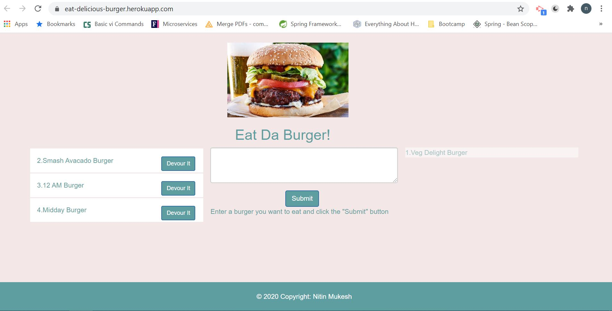

# Eat Da Burger

## Description
Eat-Da-Burger! is a restaurant app that lets users input the names of burgers they'd like to eat. It is built primarily using node.js, myswl, express and handlebars.
## Table of Contents
* [Installation](#installation)
* [Usage](#usage)
* [License](#license)
* [Contributing](#contributing)
* [Screenshot](#screenshots)
* [Application URL](#url)
* [Questions](#questions)
## Installation
Please download repository and run npm install and configure databse details in connection.js file. It is currently hosted in heroku as well and URL is given in relevant section.
## Usage
It can be used to keep track of what type of burger user wants to eat and once it is eaten then it can be marked same as well.
## Contributing
You are most welcome to contribute. There are following ways to contribute:
1. Please raise a pull request.
2. Please raise a new feature request.
3. Please raise a new issue.
All requests will be reviewed and processed accordingly.
## Screenshot

## Application URL
https://eat-delicious-burger.herokuapp.com/
## License
This application is covered by [Unlicense](./LICENSE) license
## Questions
* Please raise a request at [github](https://github.com/nitinmuk)
* For any private question/enquiry, please reach out to my email: nitinmukes@gmail.com